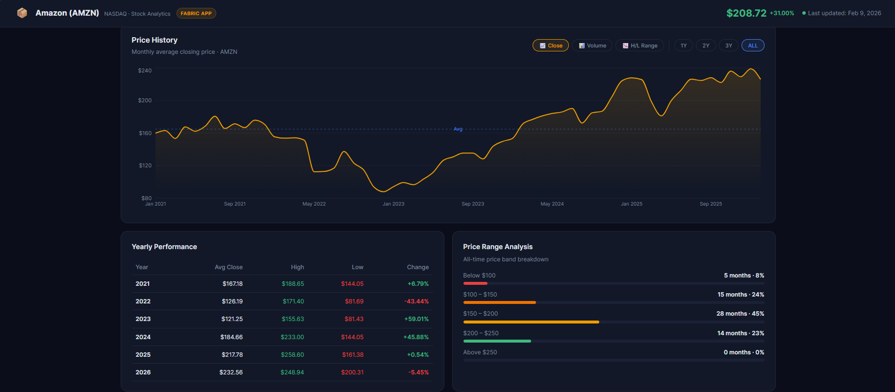

# 📦 Amazon (AMZN) Stock Analytics

> **A full-stack stock analytics dashboard built with Microsoft Fabric Apps (Rayfin) — announced at Build 2026**

🌐 **Live Demo:** *[Deploy URL after `npx rayfin up`]*

---

## 📸 Screenshot



---

## 🎯 About

A fully functional stock analytics web application running on **Microsoft Fabric**, built using the **Rayfin** open-source SDK announced at **Microsoft Build 2026**.

Data source: **Amazon Daily Stock Price Semantic Model** (FabricApp Workspace · Jan 2021 – Feb 2026)

| Metric | Value |
|--------|-------|
| 📅 Trading Days | 1,281 |
| 🚀 All-Time High | $254.00 |
| 📉 All-Time Low | $81.82 |
| 📊 5Y Avg Close | $164.88 |
| 📈 Total Return | +31.00% |

---

## ✨ Features

- **KPI Cards** — Last close, all-time high/low, 5Y average, trading days
- **Price History** — Interactive area chart with 1Y / 2Y / 3Y / ALL range filter
- **Volume Chart** — Monthly average trading volume bar chart
- **H/L Range Chart** — High, Low and Close composed chart
- **Yearly Performance Table** — Avg close, high, low, % change per year (2021–2026)
- **Price Range Analysis** — How many months spent in each price band
- **Power BI Embedded** — Original report embedded directly from FabricApp workspace

---

## 🛠️ Tech Stack

| Layer | Technology |
|-------|------------|
| **Backend infrastructure** | Microsoft Fabric Apps (Rayfin SDK) |
| **Hosting** | Microsoft Fabric Static Hosting |
| **Frontend** | React 18 + Vite |
| **Charts** | Recharts |
| **Language** | TypeScript |
| **Deploy** | `npx @microsoft/rayfin-cli up` |

---

## 🚀 Getting Started

### Prerequisites
- Node.js v18+
- Microsoft Fabric account
- "Fabric apps (preview)" enabled by tenant admin

### Steps

```bash
# 1. Clone
git clone https://github.com/Muslu3461/amazon-stock-app
cd amazon-stock-app

# 2. Install
npm install --ignore-scripts

# 3. Run locally
npm run dev
# → http://localhost:5174

# 4. Login
npx @microsoft/rayfin-cli login --encryption-fallback-enabled

# 5. Deploy to Fabric
npx @microsoft/rayfin-cli up --workspace <workspace> --encryption-fallback-enabled
```

---

## 💡 Why Rayfin?

- ✅ No backend server to manage
- ✅ Static hosting included in Fabric
- ✅ Microsoft Entra SSO built-in
- ✅ Lives next to your semantic models in the same workspace
- ✅ One command deploy: `npx @microsoft/rayfin-cli up`

---

## 👤 Author

**Muhammet Muslu** — Senior BI Specialist & Data Analyst

[](https://www.linkedin.com/in/mmuslu/)
[](https://github.com/Muslu3461)

---

*Built with ❤️ using Microsoft Fabric Apps (Rayfin) — Build 2026*
